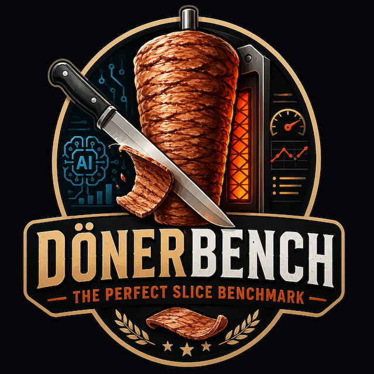

<p align="center">
  
</p>

<h1 align="center">DönerBench</h1>
<p align="center"><strong>The Perfect Slice Benchmark</strong></p>
<p align="center">
  An AI-agent benchmark where multiple LLMs compete to slice a rotating döner cone.
  Each model is given the same prompt, controls a virtual knife with real physical
  parameters, and gets a fixed number of attempts to produce the perfect slice —
  reasoning over the full history of its own past attempts.
</p>

> **Logo & icon:** the logo lives at [`frontend/public/logo.png`](frontend/public/logo.png) and is wired up as the web-app favicon ([`frontend/index.html`](frontend/index.html)). Replace that one file to rebrand both. (An `logo.svg` placeholder is kept as a fallback icon.)

## Demo

<p align="center">
  
</p>
<p align="center">
  <sub>▶ Full-quality video: <a href="https://github.com/akin-demir/donerbench/raw/main/assets/demo.mp4">assets/demo.mp4</a></sub>
</p>

---

## What it is

- **Multiple LLMs, one task.** Pick the models you want to compare; the screen splits into a side-by-side 3D replay of each agent's run.
- **Attempt-driven.** A run is **N slice attempts** (not a wall-clock timer). The model is queried once per attempt, commits one slice, and the cone rotates to a fresh surface before the next attempt.
- **History-aware.** Every query carries the **full record of prior attempts** — each past command and the slice it produced — so the model can correct itself toward the perfect slice.
- **Objective scoring.** Slices are scored on thickness consistency, freshness, cookedness, tearing, and waste, then combined into a ranked leaderboard.

The Python backend owns the deterministic simulation, scoring, and agent API. The React + Three.js frontend renders the replay panels, live metrics, and comparison tables.

## Quick start (Docker Compose)

The fastest way to run the whole stack:

```bash
cp .env.example .env      # then add your API keys (see "Add an LLM" below)
docker compose up --build
```

Then open **http://127.0.0.1:5173**.

- Frontend (Vite dev server) is published on `5173`; the backend (FastAPI) on `8000`.
- The frontend proxies `/api` to the backend automatically (`BACKEND_URL` is set in [`docker-compose.yml`](docker-compose.yml)).
- `.env` is loaded into the **backend** container, so that's where model keys/endpoints belong. It's optional — without keys you can still run in offline `profile` mode (see below).
- Stop with `Ctrl-C`; rebuild after dependency changes with `docker compose up --build`.

## Add an LLM for comparison

Agents are defined in one place — [`backend/donerbench/agents/registry.py`](backend/donerbench/agents/registry.py). `AGENT_DEFINITIONS` is the source of truth; `GET /api/agents` exposes the catalog and the UI lists every configured agent. Add an entry, set its key/endpoint in `.env`, restart, and it appears as a selectable competitor.

### Hosted models (OpenAI, Anthropic)

```python
# registry.py
AGENT_DEFINITIONS = {
    "claude-opus-4.6": AgentDefinition(
        id="claude-opus-4.6",
        agent_type=HostedModelAgent,
        name="Claude Opus 4.6",
        provider="anthropic",
        model="claude-opus-4-6",
        base_url="https://api.anthropic.com/v1",
        api_key_env="ANTHROPIC_API_KEY",
        style="precision",            # used only as the offline profile-mode fallback
    ),
    "gpt-5.5": AgentDefinition(
        id="gpt-5.5",
        agent_type=HostedModelAgent,
        name="GPT-5.5",
        provider="openai",
        model=os.getenv("OPENAI_MODEL", "gpt-5.5"),   # override to a model your account serves
        base_url="https://api.openai.com/v1",
        api_key_env="OPENAI_API_KEY",
        style="reasoning",
    ),
}
```

Then put the keys in `.env`:

```bash
ANTHROPIC_API_KEY=sk-ant-...
OPENAI_API_KEY=sk-...
# OPENAI_MODEL=gpt-5.5
```

`GET /api/agents` reports whether each required key is configured; it never returns the secret. An agent whose key is missing is shown disabled in the UI.

### Local / self-hosted models (Ollama, LM Studio, vLLM, …)

Any OpenAI-compatible endpoint works. Local agents are driven by an **environment variable for the base URL** (no hardcoded default — that keeps an unset endpoint from pointing at an unreachable host):

```python
"qwen3.6": AgentDefinition(
    id="qwen3.6",
    agent_type=HostedModelAgent,
    name="Qwen3.6",
    provider="local",
    model="cyankiwi/Qwen3-VL-32B-Instruct-AWQ-4bit",
    base_url_env="LOCAL_LLM_QWEN_BASE_URL",   # set this in .env to enable the agent
    style="throughput",
),
```

```bash
# .env — in Docker, host.docker.internal points back to your host machine
LOCAL_LLM_QWEN_BASE_URL=http://host.docker.internal:11434/v1
```

A local agent is only selectable once its `base_url_env` is set.

### Modes & resilience

- **Live (default):** agents call their configured endpoint and must return a JSON action. On a failed/malformed response the agent retries once, then reuses its last valid action and records the error in the trace — one bad call never aborts the run, and one failing agent never fails the others.
- **Offline:** set `DONERBENCH_AGENT_MODE=profile` to run deterministic heuristics instead of real model calls (useful for tests/UI work with no keys).
- **Debugging:** `DONERBENCH_LOG_LLM_PAYLOADS=true` logs the full observation payload and raw model output. `DONERBENCH_LLM_TIMEOUT_SECONDS` sets the per-call timeout.

## Local development (without Docker)

Backend:

```bash
cd backend
poetry install
poetry run uvicorn donerbench.api.main:app --reload
```

Frontend:

```bash
cd frontend
npm install
npm run dev          # opens http://127.0.0.1:5173, proxies /api to :8000
```

Run the backend tests with `cd backend && poetry run pytest`.

## How it works

### The attempt loop

A run is `slice_attempts` attempts (default 30). On each attempt the engine queries the agent **once**, applies the returned action, and (if the blade is moving fast and deep enough) emits one slice; the in-between render ticks just rotate the cone so the next attempt meets fresh meat. The observation handed to the model on every attempt includes the full `action_history` (every prior attempt) and `previous_slice_metrics` (every slice so far).

### Controls (real units)

The model returns one JSON action per attempt, in physical units so it can reason concretely:

| Control | Units / range |
|---|---|
| `doner_rotation_speed` | rotations/sec (0.2–3.0) |
| `heat_temperature` | °C (120–260) |
| `knife_angle` | degrees (−60–60) |
| `knife_velocity` | cm/s (0–50) — blade draw speed |
| `inward_pressure` | N (0–40) — force into the cone |
| `vibration_frequency` | Hz (0–80) |
| `vibration_amplitude` | mm (0–4) |
| `cut_location_from_top` | fraction of cone height (0–1) |
| `cut_depth` | mm (0–20) — blade penetration |

The engine normalizes each control by its configured maximum (`*_MAX_*` constants in [`backend/donerbench/schemas/models.py`](backend/donerbench/schemas/models.py)) before applying physics, so the unit bounds only change what the model speaks — not the scoring.

### Scoring

Each slice gets a `slice_score` from uniformity, freshness, cookedness, low tearing, and low waste, plus a `valid` flag (a usable shave: ~2–8.5 mm thick, enough area, not torn). A run's final score follows the concept formula, normalized to 0–100:

```text
final_score =
  0.25 * average_slice_quality      +
  0.20 * uniformity_score           +
  0.15 * freshness_score            +
  0.15 * valid_slice_count_score    +   # valid slices / attempts
  0.10 * low_waste_score            +
  0.10 * low_tear_score             +
  0.05 * speed_score                    # slices that cut / attempts
```

Agents are ranked by `final_score` (descending). Each leaderboard row also shows valid-slice count, average thickness/area/freshness, waste, tearing, and a human verdict ("Perfect service", "Too aggressive", …).

## Project structure

```text
backend/
  donerbench/
    agents/       agent API + hosted/local model adapter + registry (add agents here)
    api/          FastAPI app
    benchmark/    multi-agent runner + background job manager
    schemas/      Pydantic contracts + physical unit constants
    scoring/      scoring formula
    simulation/   deterministic attempt-driven engine
  tests/
frontend/
  public/         logo.png (favicon + README logo), logo.svg (fallback)
  src/
    api/          backend client
    components/    UI panels and tables
    rendering/     Three.js viewport
    state/         Zustand store
    types/         TypeScript contracts
assets/           media (demo video)
```

## API

- `GET /api/health`
- `GET /api/agents` — the agent catalog + per-agent config status
- `POST /api/benchmark/jobs` — start a run; returns a job id immediately
- `GET /api/benchmark/jobs/{job_id}` — poll progress / partial frames / final result
- `POST /api/benchmark/run` — synchronous run (mostly for tests / profile mode)

The benchmark request accepts selected `agent_ids`, `seed`, `slice_attempts`, `ticks_per_second`, and `environment` config. For real model agents prefer the **job** endpoints — model calls run in a background worker and the frontend polls for progress.